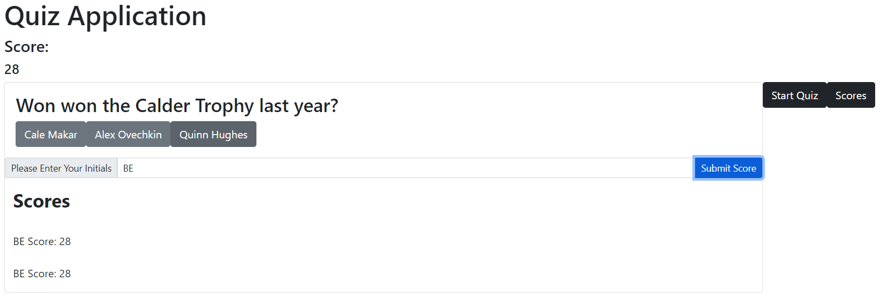

# QuizApplication-
The application will begin a countdown from 60 when the user starts the quiz, and each of the 4 questions will remove 10 seconds in answer incorrectly. 

After the quiz is completed the user can enter their initials and see their score along with any other scores recorded in the session. 

https://benelliott111.github.io/QuizApplication-/

